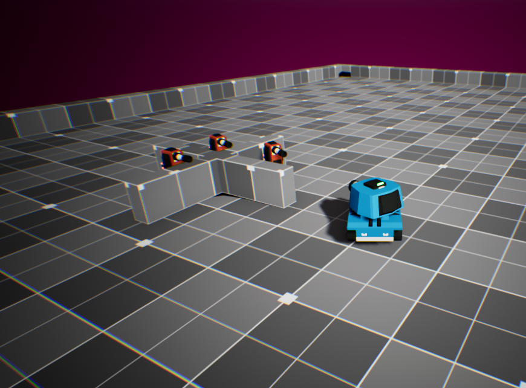
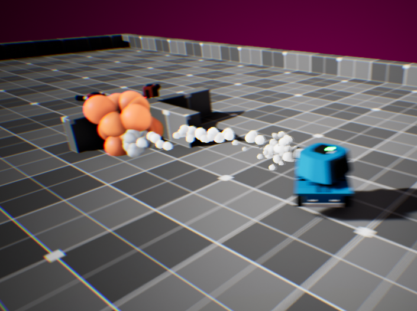

# ToonTanks

Introductory project to game development with UE4 and C++.

Game consists of a tank and enemy towers. Demonstrates simple hit, damage and health components.     

   
Basic particle effects were used for the project.   

